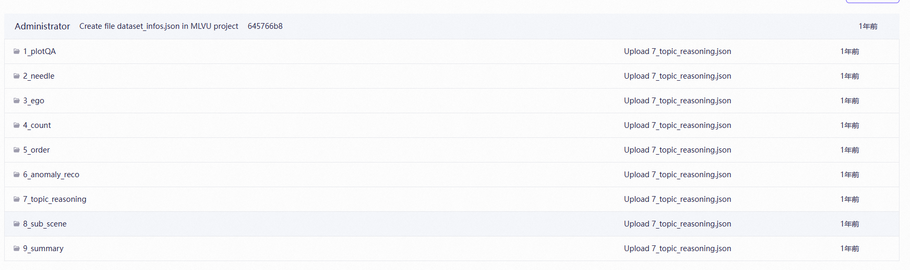
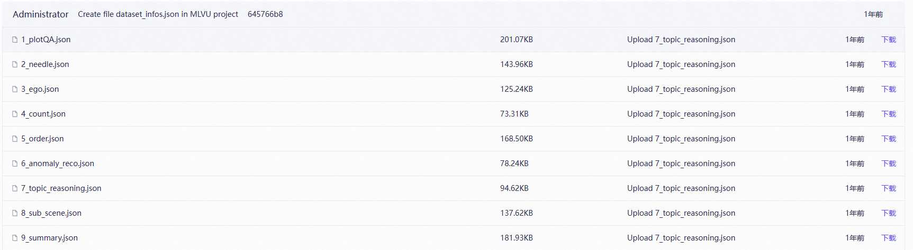

# MLVU Evaluation with Qwen-3 Series

- **Important:** This evaluates the MLVU **Dev** set, not the Test set.
- Dataset link: https://www.modelscope.cn/datasets/AI-ModelScope/MLVU/files
- **Run `Async_API_answer_video_questions_dev.py`** (not `_test.py`).

## Dataset Layout

Videos are organized by question category, with each folder containing the relevant videos:

<p align="center">
  
</p>

Pre-processed JSON question files are provided under `MM-Mem/Baseline/MLVU/Dataset/Dev`:

<p align="center">
  
</p>

## Step 1: Configure vLLM OpenAI-Compatible Server

```python
BASE_URL = "http://localhost:8002/v1"
API_KEY = "EMPTY"
MODEL_NAME = "Qwen3-VL-2B-Instruct"  # Must match --served-model-name in vLLM
```

## Step 2: Set File Paths

```python
# Video root directory (use absolute paths)
VIDEO_DIR = "/path/to/MLVU/video"

# Pre-processed JSON question directory
JSON_DIR = "/path/to/MM-Mem/Baseline/MLVU/Dataset/Dev"

# Concurrency
MAX_CONCURRENT_REQUESTS = 15
```
