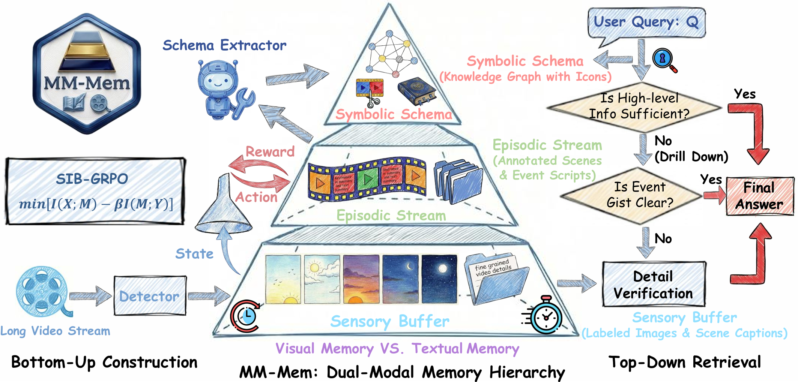

# MM-Mem: From Verbatim to Gist Distilling Pyramidal Multimodal Memory via Semantic Information Bottleneck for Long-Horizon Video Agents

<p style="text-align: left;">
  <a href="https://arxiv.org/pdf/2603.01455"></a>
</p>

This repository contains the official **PyTorch** implementation of:

> [**From Verbatim to Gist: Distilling Pyramidal Multimodal Memory via Semantic Information Bottleneck for Long-Horizon Video Agents**](https://arxiv.org/pdf/2603.01455)
>
> Niu Lian\*, Yuting Wang\*, Hanshu Yao, Jinpeng Wang, Bin Chen, Yaowei Wang, Min Zhang, and Shu-Tao Xia.

---

> **Note**: This repository contains a partial release of the code. The complete implementation will be made available gradually. Stay tuned for upcoming updates!



## 1. Introduction

**MM-Mem** is a novel multimodal memory architecture inspired by **Fuzzy-Trace Theory** for long-horizon video understanding. It overcomes the limitations of existing paradigms by structuring memory hierarchically into three layers:

- **Sensory Buffer (L1)** — fine-grained episodic memory via scene-level keyframe captioning (5fps).
- **Episodic Stream (L2)** — semantic memory produced by a Memory Manager Agent that aggregates L1 nodes via ADD_NEW / MERGE / DISCARD decisions (2fps).
- **Symbolic Schema (L3)** — high-level knowledge graph for global video understanding (1fps).

This pyramidal design enables progressive distillation from verbatim perceptual traces to abstract semantic schemas. To optimize the trade-off between memory compression and task-relevant information retention, we introduce the **SIB-GRPO** optimization framework, which governs the dynamic construction of memory for efficient reasoning. MM-Mem further employs an **entropy-driven top-down memory retrieval** strategy, starting from high-level schemas and progressively drilling down to more detailed layers when needed.

Our approach achieves **state-of-the-art performance** across multiple benchmarks for both offline and streaming video understanding tasks.

## 2. Repository Structure

```
MM-Mem/
  build_retrieve/    # Memory construction (L1->L2->L3) & retrieval pipeline
  SIB_GRPO/          # GRPO reinforcement learning training for Memory Manager
  Baseline/          # Baseline evaluation scripts for all benchmarks
  figures/           # Pipeline diagrams
```

## 3. Getting Started

### 3.1 Requirements

- Python >= 3.10
- PyTorch >= 2.0
- CUDA-compatible GPU(s)

Install the core dependencies:

```bash
pip install torch decord numpy pillow tqdm
pip install scenedetect[opencv]          # scene detection
pip install sentence-transformers        # embedding + reranking for retrieval
pip install vllm                         # model serving
pip install qwen-vl-utils               # multimodal input processing
pip install peft                         # LoRA for GRPO training
```

### 3.2 Model Deployment (vLLM)

MM-Mem uses [vLLM](https://github.com/vllm-project/vllm) to serve VLMs. All models are loaded via vLLM's Python API (in-process, no HTTP server required).

Example vLLM server deployment for baselines:

```bash
python -m vllm.entrypoints.openai.api_server \
  --model <path-to-model> \
  --served-model-name <model-name> \
  --max-model-len 128000 \
  --tensor-parallel-size 1 \
  --gpu-memory-utilization 0.9 \
  --trust-remote-code \
  --enforce-eager \
  --disable-mm-preprocessor-cache \
  --limit-mm-per-prompt '{"image": 256}'
```

> **Note:** Replace `<path-to-model>` with actual checkpoint paths. Adjust `--tensor-parallel-size` for multi-GPU setups.

## 4. Memory Construction & Retrieval

The `build_retrieve/` module implements the full memory pipeline.

### 4.1 Build Memory

Construct three-layer memory (L1 -> L2 -> L3) for a video:

```bash
cd build_retrieve
python main.py build \
    --video_path /path/to/video.mp4 \
    --output_dir ./output \
    --base_model_path /path/to/Qwen3-VL-8B-Instruct
```

### 4.2 Retrieve & Answer

Answer a question using pre-built memory with entropy-gated hierarchical retrieval:

```bash
python main.py retrieve \
    --video_path /path/to/video.mp4 \
    --memory_dir ./output \
    --video_id <video_name> \
    --question "What happens in the video?" \
    --options "A. ..." "B. ..." "C. ..." "D. ..."
```

### 4.3 Batch Evaluation

Run evaluation on an entire dataset (e.g., VideoMME):

```bash
python main.py eval \
    --dataset videomme \
    --data_dir /path/to/videomme \
    --video_dir /path/to/videos \
    --duration short \
    --memory_dir ./output \
    --output_file results.jsonl
```

The retrieval pipeline follows a top-down strategy with entropy-based early stopping:
1. **Initial VQA** — direct answer; if confident (max_prob >= 0.8), stop.
2. **L3 Knowledge Graph Retrieval** — BGE embedding coarse ranking + cross-encoder reranking.
3. **L2 Text + Visual Retrieval** — embedding search + MLLM yes-token verification.
4. **L1 Visual Retrieval** — direct MLLM relevance scoring for final answer.

## 5. SIB-GRPO Training

Train the L2 Memory Manager Agent with **SIB-GRPO** (Semantic Information Bottleneck - Group Relative Policy Optimization):

```bash
cd SIB_GRPO
python train.py \
    --policy_model_path /path/to/Qwen3-VL-8B-Instruct \
    --base_model_path /path/to/Qwen3-VL-8B-Instruct \
    --supervisor_model_path /path/to/supervisor-model \
    --data_dir /path/to/json_folder \
    --video_dir /path/to/videos \
    --num_generations 8 \
    --lora_rank 64 \
    --num_epochs 3
```

The training pipeline:
1. **Rollout**: Sample G trajectories of L2 decisions (ADD_NEW/MERGE/DISCARD) per video.
2. **Reward**: Compute composite reward (VQA correctness + supervisor signal + caption length penalty).
3. **GRPO Update**: Group-normalize advantages and update LoRA parameters with clipped policy gradient + KL regularization.

## 6. Evaluation Benchmarks

Baseline scripts are provided under `Baseline/`. See the [Baseline README](Baseline/README.md) for details.

| Benchmark | Type | Baseline Scripts |
|-----------|------|-----------------|
| **Video-MME** | Offline video QA | `Baseline/Video-MME/` |
| **HD-EPIC** | Egocentric video QA | `Baseline/HD-EPIC/` |
| **MLVU** | Long video understanding (Dev set) | `Baseline/MLVU/` |
| **VStream-QA** | Streaming video QA | `Baseline/VStream-QA/` |

## 7. Citation

If you find our code useful, please consider citing:

```bibtex
@article{lian2025mmmem,
  title={From Verbatim to Gist: Distilling Pyramidal Multimodal Memory via Semantic Information Bottleneck for Long-Horizon Video Agents},
  author={Lian, Niu and Wang, Yuting and Yao, Hanshu and Wang, Jinpeng and Chen, Bin and Wang, Yaowei and Zhang, Min and Xia, Shu-Tao},
  journal={arXiv preprint arXiv:2603.01455},
  year={2025}
}
```
